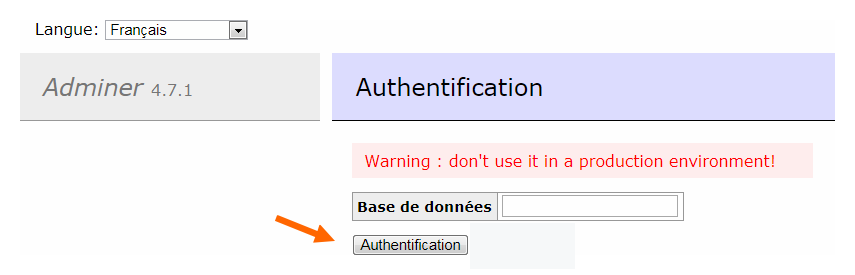
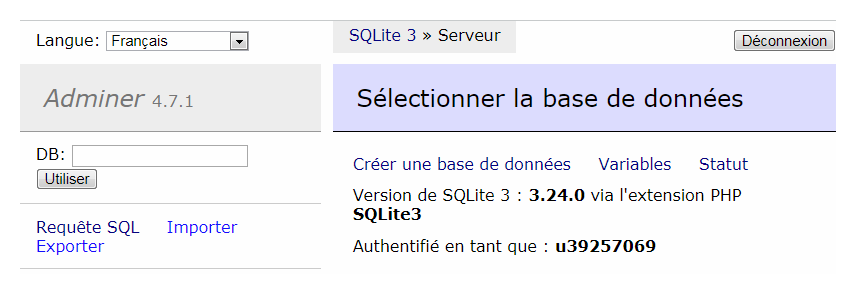
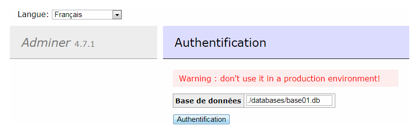

:fr: [fr](#fr-plug-in-adminer-pour-se-connecter-%C3%A0-une-base-de-donn%C3%A9es-sqlite3-sans-informations-didentification)
## :us: Adminer plugin to login to a Sqlite3 database without credentials
### :construction: TODO
## :fr: Plug-in Adminer pour se connecter à une base de données Sqlite3 sans informations d'identification
Ce plug-in pour l'application Web [Adminer](https://www.adminer.org/en/) permet de se « connecter à un serveur de bases de données [SQLite3](https://www.sqlite.org/index.html) » sans avoir besoin de fournir d'informations d'identification (*credientials*).

> :warning: Ce plug-in ne doit pas être utilisé dans un environnement de production : 
> * il donne accès à toutes les bases de base de données SQLite3 accessibles par l'instance du script PHP
> * il permet de créer une base de données SQLite3 n'importe où dans l'arborescence du système de fichiers qui accessible par l'instance du script PHP
### :gear: Installation du plug-in
Le plug-in s'utilise comme n'importe quels autres [plug-ins de Adminer](https://www.adminer.org/en/plugins/), c'est-à-dire qu'il nécessite les fichiers suivants :

Dossier | Script | Description
:--|:--|:--
```./plugins```|```plugin.php```|le fichier de base des plug-ins
```./plugins```|```fc-sqlite-connection-without-credentials.php```|le plug-in lui-même
```./```|```adminer.php```|la version courante d'adminer
```./```|```index.php```|un « adminer » chargeant le plug-in


```php
<?php 

// ./index.php

function adminer_object() {

   require "./plugins/plugin.php";
   require "./plugins/fc-sqlite-connection-without-credentials.php";

   $plugins = array(new FCSqliteConnectionWithoutCredentials());
    
   return new AdminerPlugin($plugins);

}

require "./adminer.php";
```
### :desktop_computer: Utilisation d'Adminer avec des bases SQLite3
Il suffit de « s'authentifier » en cliquant sur le bouton Authentification en indiquant (ou non) le chemin d'une base de donnée existante.
#### :arrow_forward: Authenfication pour créer une nouvelle base SQLite3
* La connexion s'effectue sans indiquer de base de données.


* Il est alors possible de créer une nouvelle base de données.


#### :arrow_forward: Authenfication sur base SQLite3 existante
* La connexion s'effectue en indiquant le chemin « système de fichiers serveur » d'une base de données existante.


