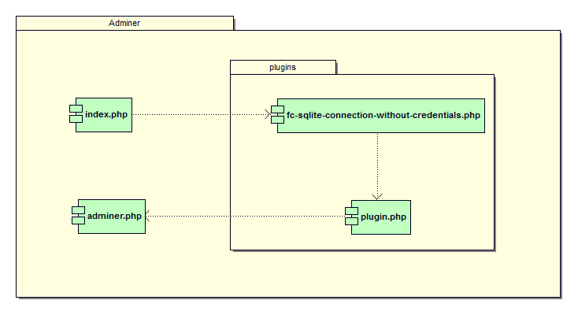

## :us: Adminer plugin to login to a SQLite3 database without credentials
This plugin for the Web application [Adminer](https://www.adminer.org/en/) allows you to "connect to a database server [SQLite3](https://www.sqlite.org/index.html)" without the need to provide credentials.
> :warning: This plugin should not be used in a production environment:
> * it gives access to all the SQLite3 database databases accessible by the PHP script instance
> * it allows you to create a SQLite3 database anywhere in the file system tree that can be accessed by the PHP script instance

### :gear: Installing the plugin
The plugin is used like any other [Adminer plugins](https://www.adminer.org/en/plugins/), that is to say that it requires the following files:

Folder | Script | Description
:--|:--|:--
```./plugins```|```plugin.php```|the plugin base file
```./plugins```|```fc-sqlite-connection-without-credentials.php```|the plugin itself
```./```|```adminer.php```|the current version of admin
```./```|```adminer-4-sqlite3.php```|an "Adminer" loading the plugin



```php
<?php

// ./adminer-4-sqlite3.php

function adminer_object () {

    require "./plugins/plugin.php";
    require "./plugins/fc-sqlite-connection-without-credentials.php";

    $ plugins = array (new FCSqliteConnectionWithoutCredentials ());
    
    return new AdminerPlugin ($ plugins);

}

require "./adminer.php";
```
### :desktop_computer: Using Adminer with SQLite3 databases
Simply "authenticate" by clicking on the Authentication button by indicating (or not) the path of an existing database.

#### :arrow_forward: Authenfication to create a new SQLite3 database
* The connection is made without indicating a database.
* It is then possible to create a new database.


#### :arrow_forward: Authentication on an existing SQLite3 database
* The connection is made by specifying the "server file system" path of an existing database.


## :fr: Plug-in Adminer pour se connecter à une base de données SQLite3 sans informations d'identification
Ce plug-in pour l'application Web [Adminer](https://www.adminer.org/en/) permet de se « connecter à un serveur de bases de données [SQLite3](https://www.sqlite.org/index.html) » sans avoir besoin de fournir d'informations d'identification (*credentials*).

> :warning: Ce plug-in ne doit pas être utilisé dans un environnement de production : 
> * il donne accès à toutes les bases de base de données SQLite3 accessibles par l'instance du script PHP
> * il permet de créer une base de données SQLite3 n'importe où dans l'arborescence du système de fichiers qui accessible par l'instance du script PHP
### :gear: Installation du plug-in
Le plug-in s'utilise comme n'importe quels autres [plug-ins de Adminer](https://www.adminer.org/en/plugins/), c'est-à-dire qu'il nécessite les fichiers suivants :

Dossier | Script | Description
:--|:--|:--
```./plugins```|```plugin.php```|le fichier de base des plug-ins
```./plugins```|```fc-sqlite-connection-without-credentials.php```|le plug-in lui-même
```./```|```adminer.php```|la version courante d'adminer
```./```|```adminer-4-sqlite3.php```|un « adminer » chargeant le plug-in


```php
<?php 

// ./adminer-4-sqlite3

function adminer_object() {

   require "./plugins/plugin.php";
   require "./plugins/fc-sqlite-connection-without-credentials.php";

   $plugins = array(new FCSqliteConnectionWithoutCredentials());
    
   return new AdminerPlugin($plugins);

}

require "./adminer.php";
```
### :desktop_computer: Utilisation d'Adminer avec des bases SQLite3
Il suffit de « s'authentifier » en cliquant sur le bouton Authentification en indiquant (ou non) le chemin d'une base de donnée existante.
#### :arrow_forward: Authenfication pour créer une nouvelle base SQLite3
* La connexion s'effectue sans indiquer de base de données.
* Il est alors possible de créer une nouvelle base de données.


#### :arrow_forward: Authenfication sur base SQLite3 existante
* La connexion s'effectue en indiquant le chemin « système de fichiers serveur » d'une base de données existante.


