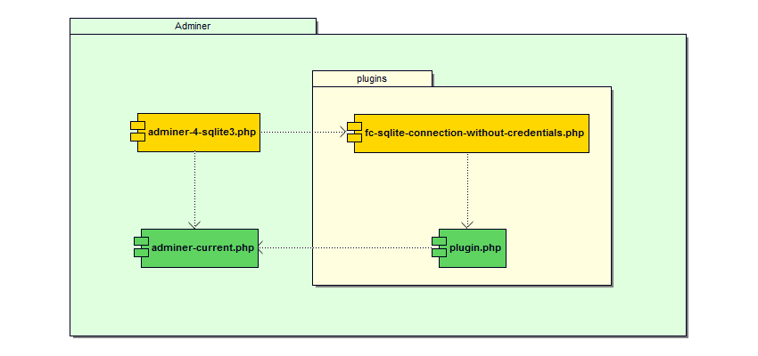

## :us: Adminer plugin to login to a SQLite3 database without credentials
This plugin for the Web application [Adminer](https://www.adminer.org/en/) allows you to "connect to a database server [SQLite3](https://www.sqlite.org/index.html)" without the need to provide credentials **(no username and no password)**.
> :warning: This plugin should not be used in a production environment:
> * it gives access to all the SQLite3 databases accessible by the PHP script instance
> * it allows you to create a SQLite3 database anywhere in the file system tree that can be accessed by the PHP script instance

:medal_sports: This plugin is now in the official list of [User Contributed Plugins for Adminer](https://www.adminer.org/en/plugins/#user).

## :construction_worker: Install or :new: :gear: Compile or :robot: Use
### :construction_worker: Install the plugin
The plugin is used like any other [Adminer plugins](https://www.adminer.org/en/plugins/), that is to say that it requires the following files:

Folder | Script | Description
:--|:--|:--
```./plugins```|```plugin.php```|the plugin base file
```./plugins```|```fc-sqlite-connection-without-credentials.php```|the plugin itself
```./```|```adminer-current.php```|the current version of adminer
```./```|```adminer-4-sqlite3.php```|an "Adminer" loading the plugin



```php
<?php 

// ./adminer-4-sqlite3.php

$_GET['sqlite'] = '';

function adminer_object() {

   require "./plugins/fc-sqlite-connection-without-credentials.php";
   require "./plugins/plugin.php";
  
   $plugins = array(new FCSqliteConnectionWithoutCredentials());
    
   return new AdminerPlugin($plugins);

}

require "./adminer-current.php";
```

### :new: :gear: Compile a single file version
This script is used to *compile* a SQLite3 "dedicated" Adminer file:
* easy installation (a file to copy)
* light size (< 190Ko)
* can embedded your favorite design
* respect the philosophy of Adminer
> Adminer consist of a single file ready to deploy to the target server.

:memo: You can contribute by filling the warning translations file (`warning-translations.csv`)

### Examples of usage
* How to use it
```
> ./compile.sh
usage: ./compile.sh languagecode [design]
```
* First usage
```
> ./compile.sh en
1. Load adminer's sources:

Clonage dans 'adminer'...
remote: Enumerating objects: 22712, done.
remote: Total 22712 (delta 0), reused 0 (delta 0), pack-reused 22712
Réception d'objets: 100% (22712/22712), 7.81 MiB | 3.55 MiB/s, fait.
Résolution des deltas: 100% (16486/16486), fait.
Sous-module 'JsShrink' (git://github.com/vrana/JsShrink) enregistré pour le chemin 'externals/JsShrink'
Sous-module 'jush' (git://github.com/vrana/jush) enregistré pour le chemin 'externals/jush'
Clonage dans '/home/francois/adminer/compile/adminer/externals/JsShrink'...
remote: Enumerating objects: 55, done.        
remote: Total 55 (delta 0), reused 0 (delta 0), pack-reused 55        
Réception d'objets: 100% (55/55), 116.93 KiB | 410.00 KiB/s, fait.
Résolution des deltas: 100% (11/11), fait.
Clonage dans '/home/francois/adminer/compile/adminer/externals/jush'...
remote: Enumerating objects: 1231, done.        
remote: Total 1231 (delta 0), reused 0 (delta 0), pack-reused 1231        
Réception d'objets: 100% (1231/1231), 806.41 KiB | 358.00 KiB/s, fait.
Résolution des deltas: 100% (854/854), fait.
Chemin de sous-module 'externals/JsShrink' : '17cbfacae67dede6d94d94ce92214c8ca31d858e' extrait
Chemin de sous-module 'externals/jush' : '275c9cc888608f36895e3926c16e8d2e2dab0a1c' extrait

2. Load plugin code:

--2020-11-11 13:06:17--  https://raw.githubusercontent.com/FrancoisCapon/LoginToASqlite3DatabaseWithoutCredentialsWithAdminer/master/fc-sqlite-connection-without-credentials.php
Résolution de raw.githubusercontent.com (raw.githubusercontent.com)… 151.101.120.133
Connexion à raw.githubusercontent.com (raw.githubusercontent.com)|151.101.120.133|:443… connecté.
requête HTTP transmise, en attente de la réponse… 200 OK
Taille : 1509 (1,5K) [text/plain]
Enregistre : «adminer/plugins/fc-sqlite-connection-without-credentials.php»

fc-sqlite-connection-without-credentials.php 100%[===========================================================================================>]   1,47K  --.-KB/s    ds 0s      

2020-11-11 13:06:18 (7,81 MB/s) - «adminer/plugins/fc-sqlite-connection-without-credentials.php» enregistré [1509/1509]

3. Adding the plugin to the sources

4. Search warning translation

5. Compile in language: en

adminer-4.7.7-sqlite-en.php created (191343 B).

6. Clean the sources

7. Voilà!
```
* Next usage
```
> ./compile.sh fr flat

1. Search warning translation

Attention : ne l\'utilisez pas dans un environnement de production !

2. Set the design: flat

3. Compile in language: fr

adminer-4.7.7-sqlite-fr.php created (193736 B).

4. Clean the sources

5. Voilà!

```

### :robot: Use the [latest compiled releases](https://github.com/FrancoisCapon/LoginToASqlite3DatabaseWithoutCredentialsWithAdminer/releases/latest)

## :desktop_computer: Using Adminer with SQLite3 databases
Simply "authenticate" by clicking on the Authentication button by indicating (or not) the path of an existing database.

#### :arrow_forward: Authenfication to create a new SQLite3 database
* The connection is made without indicating a database.
* It is then possible to create a new database.


#### :arrow_forward: Authentication on an existing SQLite3 database
* The connection is made by specifying the "server file system" path of an existing database.


## :fr: Plug-in Adminer pour se connecter à une base de données SQLite3 sans informations d'identification
Ce plug-in pour l'application Web [Adminer](https://www.adminer.org/en/) permet de se « connecter à un serveur de bases de données [SQLite3](https://www.sqlite.org/index.html) » sans avoir besoin de fournir d'informations d'identification (*no credentials: no username and no password*).

> :warning: Ce plug-in ne doit pas être utilisé dans un environnement de production : 
> * il donne accès à toutes les bases de données SQLite3 accessibles par l'instance du script PHP
> * il permet de créer une base de données SQLite3 n'importe où dans l'arborescence du système de fichiers qui accessible par l'instance du script PHP

:medal_sports: Ce plugin est maintenant référencé dans la liste des [User Contributed Plugins for Adminer](https://www.adminer.org/en/plugins/#user).

## :construction_worker: Installer ou :new: :gear: Compiler ou :robot: Utiliser

### :construction_worker: Installer le plug-in
Le plug-in s'utilise comme n'importe quels autres [plug-ins de Adminer](https://www.adminer.org/en/plugins/), c'est-à-dire qu'il nécessite les fichiers suivants :

Dossier | Script | Description
:--|:--|:--
```./plugins```|```plugin.php```|le fichier de base des plug-ins
```./plugins```|```fc-sqlite-connection-without-credentials.php```|le plug-in lui-même
```./```|```adminer-current.php```|la version courante d'adminer
```./```|```adminer-4-sqlite3.php```|un « adminer » chargeant le plug-in


```php
<?php 

// ./adminer-4-sqlite3.php

$_GET['sqlite'] = '';

function adminer_object() {

   require "./plugins/fc-sqlite-connection-without-credentials.php";
   require "./plugins/plugin.php";
  
   $plugins = array(new FCSqliteConnectionWithoutCredentials());
    
   return new AdminerPlugin($plugins);

}

require "./adminer-current.php";
```
### :new: :gear: Compiler une version monofichier
Ce script permet de *compiler* un Adminer monofichier "dédié" SQLite3 :
* installation facile (un fichier à copier)
* faible taille (< 190Ko)
* peut intégrer votre design favori
* respect la philosophie de Adminer
> Adminer consist of a single file ready to deploy to the target server. 

### Examples d'utilisation
* Comment l'utiliser
```
> ./compile.sh
usage: ./compile.sh languagecode [design]
```
* Première utilisation
```
> ./compile.sh en
1. Load adminer's sources:

Clonage dans 'adminer'...
remote: Enumerating objects: 22712, done.
remote: Total 22712 (delta 0), reused 0 (delta 0), pack-reused 22712
Réception d'objets: 100% (22712/22712), 7.81 MiB | 3.55 MiB/s, fait.
Résolution des deltas: 100% (16486/16486), fait.
Sous-module 'JsShrink' (git://github.com/vrana/JsShrink) enregistré pour le chemin 'externals/JsShrink'
Sous-module 'jush' (git://github.com/vrana/jush) enregistré pour le chemin 'externals/jush'
Clonage dans '/home/francois/adminer/compile/adminer/externals/JsShrink'...
remote: Enumerating objects: 55, done.        
remote: Total 55 (delta 0), reused 0 (delta 0), pack-reused 55        
Réception d'objets: 100% (55/55), 116.93 KiB | 410.00 KiB/s, fait.
Résolution des deltas: 100% (11/11), fait.
Clonage dans '/home/francois/adminer/compile/adminer/externals/jush'...
remote: Enumerating objects: 1231, done.        
remote: Total 1231 (delta 0), reused 0 (delta 0), pack-reused 1231        
Réception d'objets: 100% (1231/1231), 806.41 KiB | 358.00 KiB/s, fait.
Résolution des deltas: 100% (854/854), fait.
Chemin de sous-module 'externals/JsShrink' : '17cbfacae67dede6d94d94ce92214c8ca31d858e' extrait
Chemin de sous-module 'externals/jush' : '275c9cc888608f36895e3926c16e8d2e2dab0a1c' extrait

2. Load plugin code:

--2020-11-11 13:06:17--  https://raw.githubusercontent.com/FrancoisCapon/LoginToASqlite3DatabaseWithoutCredentialsWithAdminer/master/fc-sqlite-connection-without-credentials.php
Résolution de raw.githubusercontent.com (raw.githubusercontent.com)… 151.101.120.133
Connexion à raw.githubusercontent.com (raw.githubusercontent.com)|151.101.120.133|:443… connecté.
requête HTTP transmise, en attente de la réponse… 200 OK
Taille : 1509 (1,5K) [text/plain]
Enregistre : «adminer/plugins/fc-sqlite-connection-without-credentials.php»

fc-sqlite-connection-without-credentials.php 100%[===========================================================================================>]   1,47K  --.-KB/s    ds 0s      

2020-11-11 13:06:18 (7,81 MB/s) - «adminer/plugins/fc-sqlite-connection-without-credentials.php» enregistré [1509/1509]

3. Adding the plugin to the sources

4. Search warning translation

5. Compile in language: en

adminer-4.7.7-sqlite-en.php created (191343 B).

6. Clean the sources

7. Voilà!
```
* Utilisation suivante
```
> ./compile.sh fr flat

1. Search warning translation

Attention : ne l\'utilisez pas dans un environnement de production !

2. Set the design: flat

3. Compile in language: fr

adminer-4.7.7-sqlite-fr.php created (193736 B).

4. Clean the sources

5. Voilà!

```

### :robot: Utiliser la [dernière version pré-compliée](https://github.com/FrancoisCapon/LoginToASqlite3DatabaseWithoutCredentialsWithAdminer/releases/latest) 

## :desktop_computer: Utilisation d'Adminer avec des bases SQLite3
Il suffit de « s'authentifier » en cliquant sur le bouton Authentification en indiquant (ou non) le chemin d'une base de donnée existante.
#### :arrow_forward: Authenfication pour créer une nouvelle base SQLite3
* La connexion s'effectue sans indiquer de base de données.
* Il est alors possible de créer une nouvelle base de données.


#### :arrow_forward: Authenfication sur base SQLite3 existante
* La connexion s'effectue en indiquant le chemin « système de fichiers serveur » d'une base de données existante.


